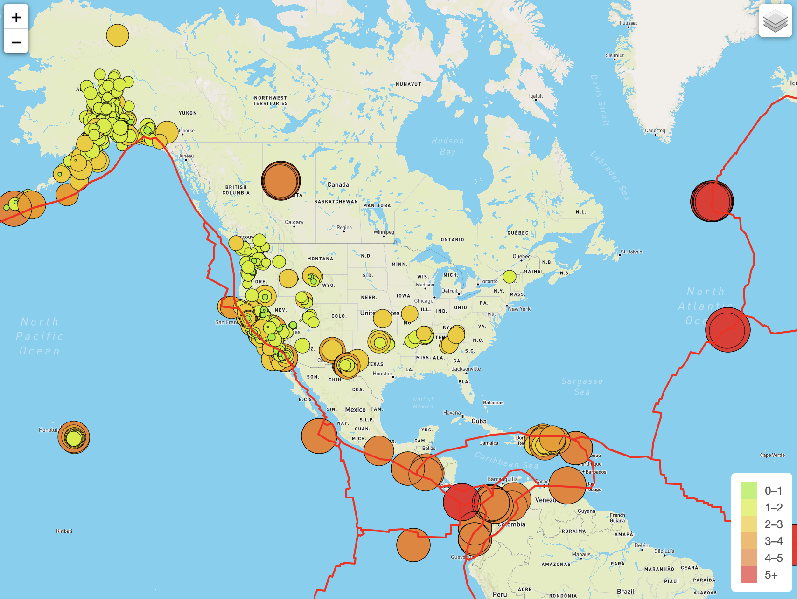

# Earthquake Challenge

## Tools Used

• Data Source: Earthquakes GeoJSON, Earthquakes above 4.5mag GeoJSON, Tectonic Plate GeoJSON

• Software: HTML/CSS, JavaScript, Visual Studio Code 1.49.1, Leaflet 1.7.1, D3.js 6.2.0

## Overview and Purpose

The objective for this project was to build insightful data visualizations for earthquakes around the world, complete with interactive features. For this project, we used JavaScript and the D3 library to traverse and retrieve GeoJSON earthquake data and tectonic plate data from the US Geological Survey in order to create an interactive map. The JavaScript and D3 library was used to create a legend that color coded the magnitude of each major quake, with darker colors indicating more intense quakes.

### Street view

## Results and Analysis

We used the leaflet library and Mapbox API to retrieve the GeoJSON data and host geographical maps. The above images shows the map with the quakes overlayed with darker colors indicating more intense quakes. Additionally, the boundaries of each seismic plate are shown in red. When observing each data point on the map, one can see that they very often overlap with the fault lines. Not wanting to leave just a single map, I created two more layers in the JavaScript files to show both a dark map and a satellite map as well. 

## Additional Maps

### Dark view

### Satellite view

